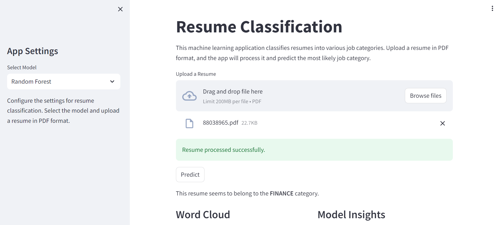

# 🚀 Project overview
Welcome to the GitHub repository! 🌟 This project focuses on automating the categorization of resume PDF documents, handling over 2400 resumes from livecareer.com collected in Kaggle. It's crafted with Machine Learning and Natural Language Processing techniques and is developed as a web-based model. Implemented on Amazon Web Services (AWS) cloud infrastructure, it also features a Streamlit interface for ease of use and interaction.

# 🎯 Objective

The primary goal here is to automate the resume categorization process with high accuracy and minimal human intervention. By harnessing the power of ML and NLP, the efficiency and effectiveness of the hiring process are significantly enhanced. This AI system is designed to manage and categorize a large number of resumes across various job categories, minimizing manual HR efforts.

**📌 Key Features**

- **🧠 Machine Learning & NLP**: Utilizing advanced ML algorithms and NLP for precise text analysis and classification.
- **📄 Resume Classification**: Automated sorting and classification of PDF resumes for streamlined recruitment.
- **☁️ AWS Cloud Integration**: Hosted on AWS cloud for reliable and scalable performance.
- **💻 Streamlit Web Interface**: An interactive and user-friendly web interface powered by Streamlit.
- **📊 Data Management**: Effective handling of large datasets with SQL for optimal data integrity and accessibility.

# 🌱 Getting Started

To begin, clone the repository to the local machine:

```
git clone https://github.com/ansak95/ResumeClassifier_NLP.git

```

## Prerequisites

Before starting, ensure the following are installed:

- Python 3.7 or higher
- Pip (Python package installer)

## Installation

Install the required packages using:

```
cd ResumeClassifier_NLP
pip install -q -r requirements.txt

```


## Running the Streamlit application

To run the Streamlit application, use:


```
streamlit run app.py
```


# Using the shell script

Alternatively, a shell script can be used to execute configuration actions on an AWS instance and install the required packages:

```
bash launch_app.sh
```


*Note: To execute the shell script on an AWS instance, edit the script to specify the {NOTEBOOK_URL}.

# AWS configuration

It's important to ensure that AWS credentials are properly configured, either using the AWS CLI or by configuring them directly in the application.

# 🖼️ Streamlit application illustration

The project features a Streamlit-based web interface, providing an interactive and user-friendly platform to demonstrate the functionalities of our ML models. This interface allows users to upload resumes, see the categorization in action, and interact with the model's outputs. To enhance the understanding of our models, we utilize SHAP values for in-depth analysis. These values help in interpreting the model's decisions, providing insights into which features are most influential in the categorization process. This addition offers a practical and engaging way for users to explore the capabilities of our system, ensuring transparency and interpretability in our machine learning models.




# 🔄 Ongoing work and improvements

This project is a work in progress. Currently, two Machine Learning models – Random Forest and MLP (Multilayer Perceptron) – are being compared and optimized for better performance. Continuous efforts are being made to enhance these models and improve their accuracy and efficiency in resume categorization.

# How to contribute

Contributions are always welcome! Whether it's improving the code, enhancing the ML model, suggesting new features, or reporting bugs, all input is valuable. The script for AWS deployment is currently under development and contributions in this area are particularly appreciated.

